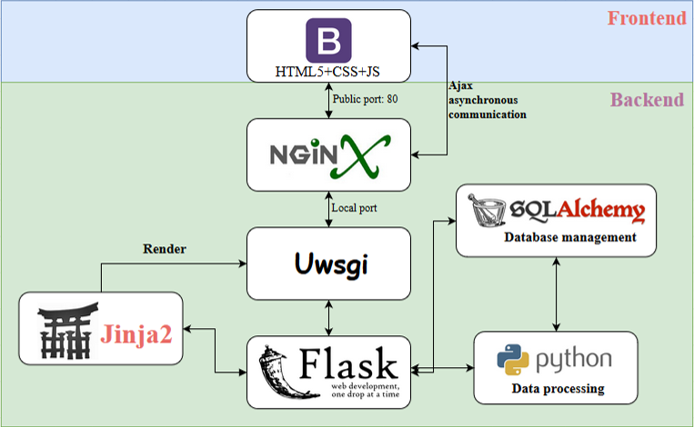

# RSVdb: A comprehensive database of *in vivo* mRNA structures

---

RNA fulfills a crucial regulatory role in cells by folding into a complex RNA structure. To date, a chemical compound, dimethyl sulfate (DMS), has been developed to effectively probe the RNA structure at the transcriptome level. We proposed a database, RSVdb (https://taolab.nwafu.edu.cn/rsvdb/), for the browsing and visualization of transcriptome RNA structures. RSVdb, including 626,225 RNAs with validated DMS reactivity from 178 samples in 8 species, supports four main functions: information retrieval, research overview, structure prediction, and resource download. Users can search for species, studies, transcripts and genes of interest; browse the quality control of sequencing data and statistical charts of RNA structure information; preview and perform online prediction of RNA structures in silico and under DMS restraint of different experimental treatments; and download RNA structure data for species and studies. Together, RSVdb provides a reference for RNA structure and will support future research on the function of RNA structure at the transcriptome level.

Main site please visit https://taolab.nwsuaf.edu.cn/rsvdb/

The repository contains the source code for the front and back ends of RSVdb. The structure of the website is: 

## Installation

You need to install python3 and run the following command:

>1. cd RSVdb
>2. pip install flask flask-blueprint flask-sqlalchemy
>3. flask run

Then, you can then visit RSVdb via http://127.0.0.1:5000/.

The repository contains the main functions of RSVdb, including data browsing and viewer. Only the main features of the site and sample transcripts are included here. Need more features, please visit "https://taolab.nwsuaf.edu.cn/rsvdb/".

